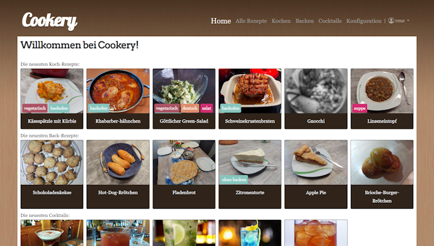

# Cookery

Cookery is self-host recipe database and website. It has been developed as digital recipe book for home users.

Cookery consists of:
* cookery-server: written in python using flask-restx, exposing a ReST API
* cookery-site: a SPA written using vue.js 2, using the API exposed by the server

Cookery focuses on presenting recipes in a clean and good to read way.
In addition, it provides a quite extensive search function.

(Currently the website is in German only)

